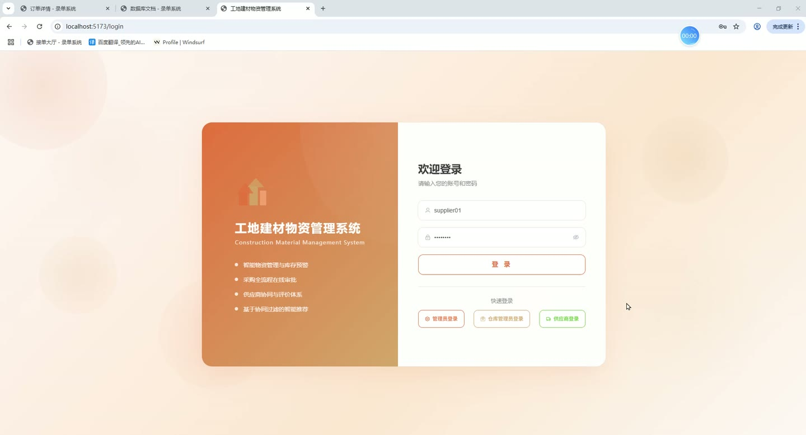
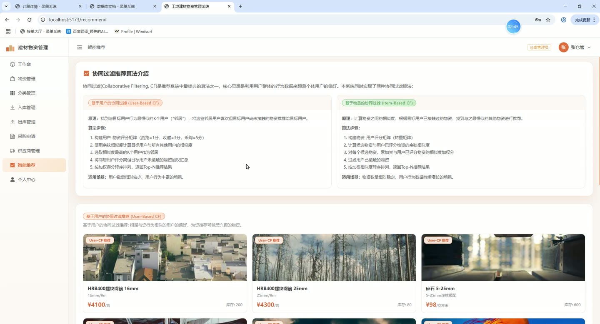
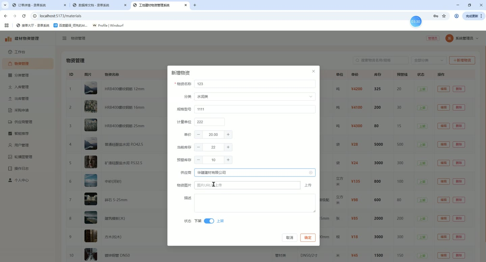
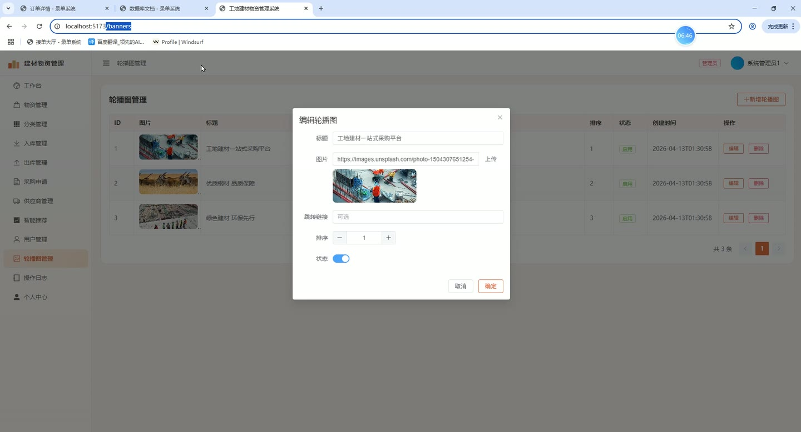
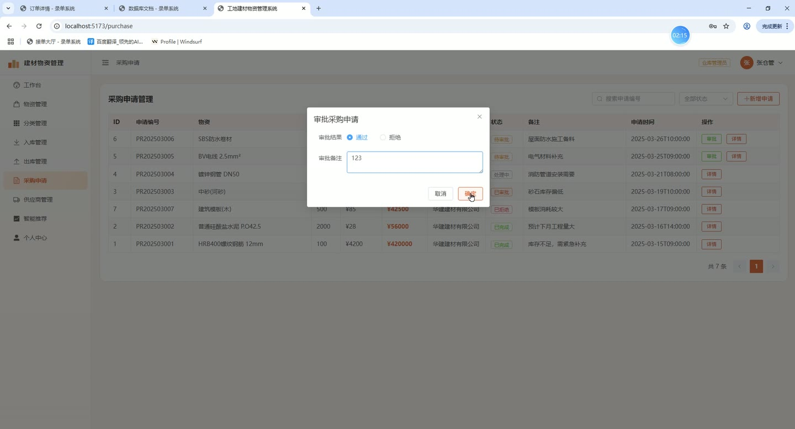
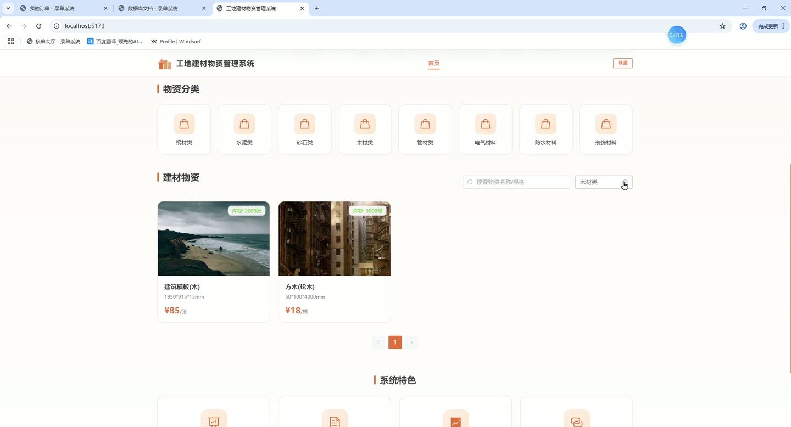

# (附文档)Springboot3+Vue3+MySQL 工地建材物资管理系统

**技术栈**：Springboot3、Vue3、MySQL

### 系统简介

工地建材物资管理系统是一套基于 SpringBoot3 + Vue3 前后端分离架构的物资全流程管理平台。系统内置管理员、仓库管理员、供应商三种角色，覆盖物资档案管理、库存出入库、采购申请审批、供应商协同、智能推荐以及操作日志审计等核心业务，适用于建筑工地、工程物资企业的日常物资数字化管理。
 
### 核心功能
 
### 管理员端

 
- 查看物资列表（支持按名称/规格关键词搜索、按分类/状态筛选），新增/编辑/删除物资档案，设置物资名称、规格、单位、单价、库存预警阈值、关联供应商 
- 管理物资分类：新增/编辑/删除分类（名称、图标、排序），支持按关键词搜索分类 
- 入库操作：选择物资、填写入库数量、关联供应商和操作人，系统自动增加对应物资的库存量 
- 出库操作：选择物资、填写出库数量、填写用途和操作人，系统自动扣减库存，若库存不足则提示失败 
- 查看库存预警列表：自动筛选出当前库存 ≤ 预警库存的物资，支持一键查看详情 
- 管理采购申请：查看全部采购申请列表（支持按申请单号/状态/申请人/供应商筛选），审批通过/驳回申请并填写审批备注 
- 管理供应商信息：新增/编辑/删除供应商（公司名称、联系人、电话、地址、经营范围、评分），支持按公司名/联系人搜索 
- 管理用户账号：新增/编辑/删除系统用户（用户名、密码、真实姓名、手机、邮箱、角色、状态），支持按用户名/真实姓名/手机搜索，按角色筛选 
- 管理轮播图：新增/编辑/删除轮播图（标题、图片、链接、排序、启用/禁用状态），前台按排序展示已启用的轮播图 
- 查看操作日志：分页查看所有用户的操作记录（操作人、操作内容、请求方法、IP地址、时间），支持按关键词/用户ID搜索 
- 查看智能推荐页面：查看基于用户协同过滤和基于物品协同过滤两种算法的物资推荐结果，可选择推荐数量 
- 查看物资统计概览：总物资数量、库存预警数量等统计指标
 
### 仓库管理员端

 
- 查看物资列表（支持按名称/规格关键词搜索、按分类/状态筛选），新增/编辑/删除物资档案，设置物资名称、规格、单位、单价、库存预警阈值、关联供应商 
- 管理物资分类：新增/编辑/删除分类（名称、图标、排序），支持按关键词搜索分类 
- 入库操作：选择物资、填写入库数量、关联供应商和操作人，系统自动增加对应物资的库存量 
- 出库操作：选择物资、填写出库数量、填写用途和操作人，系统自动扣减库存，若库存不足则提示失败 
- 查看库存预警列表：自动筛选出当前库存 ≤ 预警库存的物资，支持一键查看详情 
- 查看智能推荐页面：查看基于用户协同过滤和基于物品协同过滤两种算法的物资推荐结果 
- 查看物资统计概览：总物资数量、库存预警数量等统计指标
 
### 供应商端

 
- 查看与自己关联的供应商信息（公司名称、联系人、电话、地址、经营范围、评分） 
- 查看采购申请列表：筛选出分配给自己的采购申请单，查看申请编号、物资、数量、期望价格、状态 
- 处理采购申请：对分配给自己的申请单进行接单/拒单操作，填写供应商备注 
- 查看个人中心：修改个人资料（真实姓名、手机、邮箱、头像、密码）
 
### 技术栈

 后端框架Spring Boot 3.x ORMMyBatis-Plus（分页插件、逻辑删除） 权限认证Spring Security + JWT（BCrypt 密码加密） 前端框架Vue 3（Composition API） 状态管理Pinia 构建工具Vite 数据库MySQL（InnoDB） 前端 UIElement Plus 路由Vue Router 4（history 模式、路由守卫鉴权） 文件上传MultipartFile + 本地存储（UUID 重命名） 推荐算法基于用户协同过滤（User-CF）与基于物品协同过滤（Item-CF）
 
### 交付内容

 
- 后端完整源码 
- 前端完整源码 
- 数据库初始化脚本 
- 万字文档

## 界面展示

---

## 获取完整源码 + 万字文档

本仓库为项目介绍页。**完整前后端源码、数据库初始化脚本、万字项目文档**，请加微信 `kangkangcode`，或访问 [codekk.top](http://codekk.top) 获取。

可作课程设计 / 毕业设计参考，支持远程部署调试。